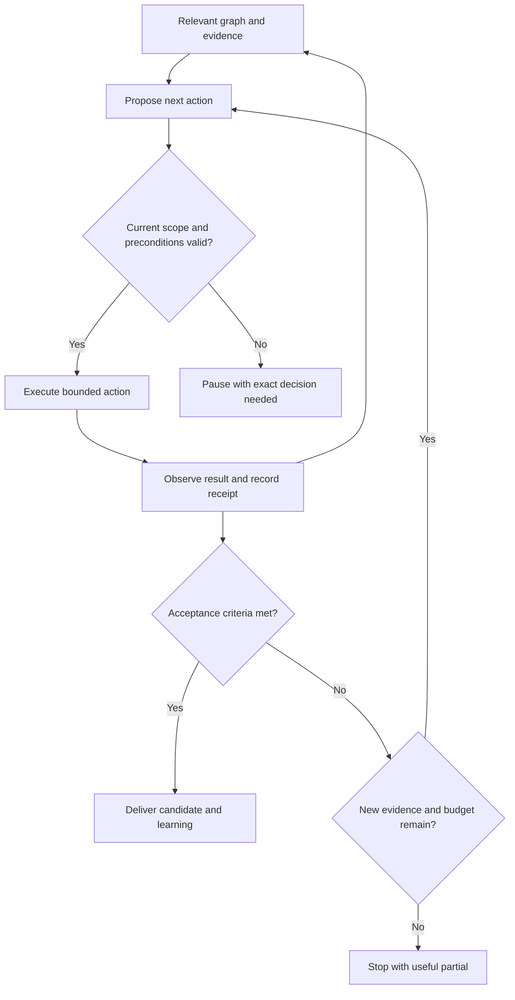

# Quirk: Loop, Graph, and Action Engineering

Candidate implementation brief · September 10, 2026

**Decision:** Connect one existing Quirk workflow into an evidence-bearing execution loop. Start with Quirk Now reconstructing a stalled candidate, using `quirk-run` PR #2 as the first real input. Establish observed action receipts and useful dependency queries before expanding automation.

Bryan benefits when Quirk can recover what matters, identify the next justified move, complete authorized work, verify the result, and carry a useful judgment forward with less reconstruction. This is the success criterion; more agents, graph nodes, or generated artifacts are not success measures.

This document uses Loop, Graph, and Action Engineering as practical working definitions. The architecture below is a Quirk proposal, not a claim that a universal standard defines these three terms or that the proposal is already implemented.

## 1. The three disciplines

| Discipline | Operating responsibility | First implementable object | Decisive question |
|---|---|---|---|
| Loop Engineering | Control progress toward a fixed objective using observations, feedback, budgets, and stop rules. | A versioned control policy referencing acceptance criteria and a run ledger. | Did another iteration improve the result enough to justify its cost? |
| Graph Engineering | Preserve typed relationships among objects, versions, evidence, dependencies, and judgments. | A provenance-bearing assertion and three bounded queries. | What supports this decision, and what changes when its support expires? |
| Action Engineering | Translate an intended outcome into an authorized, resource-specific operation with verified consequences. | An action contract extending existing grant and receipt identities. | What exactly may change, and what evidence shows what actually changed? |

The system contract is: a loop chooses the next permitted step; a graph supplies relevant relationships and evidence; the action boundary enforces scope; observations update the run and evidence projection. Changes to preferences, policy, and canon remain distinct decisions.

Updating the graph here means recording observations in a projection. It does not authorize changing accepted preferences or canonical definitions.

## 2. What already exists

Static inspection used `quirk-os` commit `499f94b8d12e29dd7804cc9b537fd70f6a8048d8`. Its main branch identifies the project as contract-first and separates canonical definitions, runtime enforcement, and projections. [Repository README](https://github.com/Quirk-Systems/quirk-os/blob/499f94b8d12e29dd7804cc9b537fd70f6a8048d8/README.md)

| Existing asset | Verified source observation | Implementation consequence |
|---|---|---|
| Control-loop designer | Describes sampling, tolerance, deadband, hysteresis, cooldown, saturation, circuit breakers, recovery, and adversarial signal tests; its ceiling is `propose`. [Source](https://github.com/Quirk-Systems/quirk-os/blob/499f94b8d12e29dd7804cc9b537fd70f6a8048d8/skills/quirk-control-loop-designer/SKILL.md) | Instantiate this control model for one workflow. A design skill alone does not demonstrate a running controller. |
| Runtime grant | Binds skill identity/version/digest, declared verbs, purpose, and validity period. [Schema](https://github.com/Quirk-Systems/quirk-os/blob/499f94b8d12e29dd7804cc9b537fd70f6a8048d8/schemas/skill-runtime-grant.schema.json) | Add exact target, argument bounds, preconditions, and effect verification through a compatible extension. |
| Runtime loader | Checks source/manifest integrity, admission references, granted authority, declared actions, and grant validity. [Implementation](https://github.com/Quirk-Systems/quirk-os/blob/499f94b8d12e29dd7804cc9b537fd70f6a8048d8/scripts/sync_control_plane/skill_runtime.py) | Carry its identity chain into the graph and dispatch boundary. Do not create a competing identity system. |
| Receipt contract/helper | Receipt schema includes inputs, outputs, grant, evidence, findings, and mutations. The helper assigns `no_authority_escalation: true` and `immutable: true`; the helper itself does not verify observed effects or enforce immutable storage. [Schema](https://github.com/Quirk-Systems/quirk-os/blob/499f94b8d12e29dd7804cc9b537fd70f6a8048d8/schemas/skill-run-receipt.schema.json), [helper](https://github.com/Quirk-Systems/quirk-os/blob/499f94b8d12e29dd7804cc9b537fd70f6a8048d8/scripts/sync_control_plane/skill_runtime.py) | Distinguish a declaration from an independently observed and durably recorded result. This is a gap in the inspected helper, not a repository-wide security verdict. |
| Runtime adapter candidate | `quirk-run` PR #2 is open at head `850e5718377751d40cff68cde2db7c943b4b7e6b`. Its body reports type/bundle checks passed, behavioral fixtures unproved, and no deployment. Its adapter binds to a specific PR #71 contract head and caps effects at `PREPARE`. [PR](https://github.com/Quirk-Systems/quirk-run/pull/2) | First prove its existing behavioral fixtures. The PR body's CI statement was read, not independently rerun or verified against live check-runs in this investigation. |

`quirk-run` main was inspected at `8c1097b8ac16de4a5a52996cd65e241810ef3e6f`; its root contains only a README. The implementation discussed above is on the PR branch. [Runtime ownership](https://github.com/Quirk-Systems/quirk-run/blob/8c1097b8ac16de4a5a52996cd65e241810ef3e6f/README.md)

## 3. Implement Loop Engineering

Use three cadences with different responsibilities:

- **Execution loop:** complete one authorized job. Freeze the objective, acceptance criteria, tool scope, and budgets for the run. Observe, propose, check, execute, verify, and stop.
- **Improvement loop:** analyze recorded failures and propose one change to a prompt, tool, retrieval rule, or controller. Compare against a frozen evaluator and held-out cases. Promotion is a separate decision.
- **Outcome loop:** check whether the accepted output helped its intended person. For Quirk Now, measure reconstruction time and correct disposition; for Career, application work completed; for BryMinn, a specific human preference between controlled variants. Do not infer these outcomes from artifact counts.

Proposed pilot limits: one initial proposal plus at most two targeted repair rounds; explicit model-call, token, wall-time, and read budgets configured before execution. A retry must address a named failure with new evidence or a changed method. Repeated unchanged state ends as `STALLED`. Budget exhaustion retains a usable partial and its exact missing proof.

Noise handling matters: require a material state change, use cooldowns for repeat alerts, and preserve urgent authority changes as immediate interrupts. Hysteresis prevents a candidate from oscillating between dispositions when weak signals fluctuate.

Persist the session outside the model process. Keep events and artifact references durable; build compact working context from them. Anthropic's April 2026 managed-agent architecture separates session, harness, and sandbox, supporting this separation as practitioner evidence. It does not establish Quirk's own reliability. [Managed Agents](https://www.anthropic.com/engineering/managed-agents)

## 4. Implement Graph Engineering

Keep meanings explicit:

| Graph view | Example relationship | What it cannot establish |
|---|---|---|
| Evidence and knowledge | Exact artifact version `supported_by` receipt; claim `contradicted_by` observation | Permission to execute |
| Dependencies and execution | Candidate `blocked_by` missing fixture; run `produced` artifact | That a scheduled step actually ran |
| Preference | Human judgment `prefers` variant for a stated purpose | Universal factual truth or permission |
| Authorization | Trusted principal `may_perform` operation on exact resource under policy | Authority inferred from an ordinary content edge |

Use an assertion record containing subject, predicate, object, source reference/digest, observer, observed time, validity interval, status, and superseded assertion. Distinguish when a fact applied from when Quirk learned it. Preserve contradictions instead of overwriting whichever one arrived first. W3C PROV-O offers established provenance concepts for derivation, attribution, generation, and invalidation. [PROV-O](https://www.w3.org/TR/prov-o/)

Start with a tiny local fixture store, then an existing PostgreSQL/Supabase projection if access and schema ownership support it. PostgreSQL offers recursive traversal and cycle handling; a dedicated graph database is not a prerequisite. Bound query depth and result size, index typed edges, and enforce tenant and resource visibility during traversal. [Recursive queries](https://www.postgresql.org/docs/current/queries-with.html)

Build these three queries before a graph explorer:

1. What evidence supports this exact version?
2. Which dependent conclusions need rechecking if this evidence changes?
3. What next action is permitted under current grants, and what blocks it?

Query 3 must consult the authoritative policy check at use time. A cached graph explanation is not an authorization decision.

GraphRAG is a later retrieval experiment. Microsoft's documentation describes several query modes, calls global search resource-intensive, and includes basic vector RAG for comparison. Start with direct source lookup and bounded neighbors; add graph-based synthesis only when a measured class of questions needs it. [GraphRAG query modes](https://microsoft.github.io/graphrag/query/overview/)

## 5. Implement Action Engineering

Reuse the current grant/receipt identities. Add a versioned extension covering:

| Contract field | Required meaning |
|---|---|
| Objective and postcondition | Intended change and independently observable success |
| Target and input digest | Exact resource/version plus canonical argument digest |
| Grant/policy references | Authenticated principal, valid authority, expiry, and revocation check |
| Preconditions | Expected source version, state, and dependencies immediately before dispatch |
| Effect limit | Allowed reads/writes, destinations, resource count, and spend bounds |
| Idempotency identity | Same logical operation returns or reconciles its prior result |
| Recovery | Retry class, timeout, partial-effect handling, compensation, and uncertain-outcome state |
| Observation and receipt | Actual target touched, before/after evidence, tool result, verifier version, limitations |

The action boundary checks authority immediately before execution, including after a pause or retry. Reuse authorization already granted for the unchanged scope. A change in target, arguments, object version, or policy can invalidate that grant's applicability.

Separate `prepare` from `commit` where the effect warrants preview. Use conditional writes or compare-and-swap when supported. An API success response is one observation; verify the resulting object when possible. If a timeout leaves success uncertain, reconcile before retrying. Do not claim exactly-once external effects merely because a workflow engine checkpoints its state. Compensation is a new operation with its own limits, not a promise that every effect is reversible.

For receipt hardening, derive checked assertions from dispatch and outcome evidence. If evidence is absent, record unknown or unverified. Introduce a schema version rather than silently changing the meaning of an existing boolean. Enforce append-only history in storage permissions; hashes alone establish neither authorized authorship nor enforced immutability.

Cloudflare Workflows already has explicit retry configuration, nonretryable errors, and documented saga-style rollback handlers. Given Quirk's existing candidate adapter, test this route first and verify compatibility with its pinned SDK. Temporal remains an alternative if concrete runtime needs outgrow it. [Cloudflare recovery](https://developers.cloudflare.com/workflows/build/sleeping-and-retrying/), [Temporal agent loop](https://docs.temporal.io/ai/cookbook/agentic-loop-tool-call-claude-python)

## 6. Other practices worth adopting

These are prioritized proposals. Source documentation establishes the mechanism, not a measured benefit for Quirk.

| Practice | Quirk implementation | First proof |
|---|---|---|
| Context engineering | Load exact relevant objects, current locks, evidence, and unresolved decisions on demand. Preserve references through compaction. [Practice](https://www.anthropic.com/engineering/effective-context-engineering-for-ai-agents) | A resumed run reconstructs the correct state without Bryan repeating it. |
| Harness engineering | Separate model, controller, persistent session, and sandbox. Pin each run's versions. [Architecture](https://www.anthropic.com/engineering/managed-agents) | Replace or restart the controller without losing the accepted objective or repeating completed effects. |
| Evaluation engineering | Grade actual outcomes alongside traces; separate capability trials from regression checks; calibrate model judges against human decisions. [Agent evals](https://www.anthropic.com/engineering/demystifying-evals-for-ai-agents) | An attractive false-success receipt fails despite fluent output. |
| Tool engineering | Expose small typed operations with informative errors and bounded responses. [Tool design](https://www.anthropic.com/engineering/writing-tools-for-agents) | A realistic task improves without increasing accidental tool calls. |
| Interoperability engineering | Put MCP/A2A adapters around Quirk contracts. Test semantic compatibility, failure states, auth scope, and actual callable verbs. [MCP security](https://modelcontextprotocol.io/docs/2025-11-25/tutorials/security/security_best_practices), [A2A specification](https://a2a-protocol.org/latest/specification/) | Changing adapter cannot broaden the exact operation/resource grant. |
| Observability and recovery | Link intent, action, observation, evaluator, and outcome by run/action IDs; record retry counts, costs, latency, interventions, and terminal reason. | Interrupt and resume; reconcile a duplicate or uncertain operation. |
| Judgment engineering | Record the comparison, chosen variant, rationale, context, and who judged. An inferred preference stays a candidate. | A later brief uses the relevant human judgment without treating it as universal. |
| Complexity discipline | Add agents for independent work and preserve one controller for sequential effects. Benchmark against simpler execution. | Improvement survives removing decorative orchestration and counting coordination cost. |

Two frontier experiments are worth watching: evidence-driven harness optimization and task-aware multiagent composition. Both have 2026 preprint evidence; neither establishes general autonomous superiority. Keep modifications reversible, predict the benefit before changing the harness, and freeze the evaluator during comparison. [Harness Engineering v4](https://arxiv.org/abs/2604.25850v4), [Scaling Agent Systems v3](https://arxiv.org/abs/2512.08296v3)

The most useful Quirk innovation to test is **evidence-triggered repair**: when a dependency changes, mark the dependent conclusion as needing revalidation, identify the smallest authorized proof, and rerun only that proof. This combines graph impact analysis, bounded feedback, and accountable action. Add a second experiment only after this works: inspect whether a human judgment improves a later creative or operational decision without copying an inappropriate preference across contexts.

## 7. First implementation sequence

Suggested sequence spans roughly two working weeks; this is a planning estimate, not a delivery commitment.

| Batch | Owner and deliverable | Exit condition |
|---|---|---|
| 1: establish the proof | `quirk-run`: check out PR #2's exact head and run its two existing behavioral fixtures in the permitted test environment. Record exact head, commands, assertions, failures, and observations. | Either demonstrated behavior or a specific reproducible defect. Type/bundle checks alone cannot satisfy this batch. |
| 2: close the contract gaps | `quirk-os`: candidate action extension, observed receipt semantics, typed graph assertions, and bounded loop policy. Reuse current identity and grant semantics. | Adversarial contract/dispatch fixtures pass at an exact version; compatibility and authority differences are explicit. |
| 3: connect one useful workflow | A candidate Quirk Now adapter produces a next-proof card from one real input, supports interruption, and carries evidence references through a bounded repair loop. | Useful candidate output, no unsupported execution claims, and measured reconstruction effort. |

The existing PR #2 adapter is tied to PR #71 at `381a2df04f6c1986f9d921459bdfbdeb869d2e8c`. Do not quietly repurpose it as a generic Quirk Now runtime. A changed contract or integration needs a distinct candidate revision and compatibility proof. Also, `propose` in the skill runtime and `PREPARE` in the activation adapter are different vocabularies; never assume they are equivalent without an explicit mapping.

Keep canonical extensions in `quirk-os`, runtime adapters in `quirk-run`, and searchable graph views as disposable projections. Existing runtime helpers inside `quirk-os` can remain where they are until a concrete extraction has an owner and compatibility benefit. UI work follows useful queries and receipts.

## 8. The first real candidate card

**Input:** `quirk-run` PR #2, observed September 10, 2026, head `850e5718377751d40cff68cde2db7c943b4b7e6b`.

- **Known:** open candidate PR; exact source contract dependency; PR body reports successful type/bundle validation.
- **Unproved:** behavioral fixture execution, independent review, production behavior, and human usefulness.
- **Next proof:** execute `fixtures/read-only-success.json` and `fixtures/authority-change-pause.json` through the documented adapter test entrypoint at that exact head. Inspect that entrypoint first; no executable test command has been invented here.
- **Expected observations:** the first fixture remains within `PREPARE` and produces its bounded result; the second pauses on an authority change without the expanded effect. Verify observations rather than trusting receipt flags.
- **Current boundary:** candidate testing and proof preparation. No evidence in this investigation changes deployment, merge, admission, or mutation authority.
- **Next human judgment:** after actual fixture proof, assess whether the card provides enough information to choose the next move without reconstructing the conversation.

The card is prepared analysis. The fixtures were not executed in this investigation.

## 9. Eleven decisive fixtures

1. Happy path produces an evidenced candidate and the correct next action.
2. Changed artifact digest makes old proof inapplicable.
3. Contradictory observations remain visible; the controller does not silently choose the convenient one.
4. Forged receipt flags cannot establish successful enforcement or immutable storage.
5. Revoked or expired grant prevents dispatch and resume.
6. Same verb against a different target is rejected by resource scope.
7. A crash after possible effect leads to reconciliation, with no blind duplicate action.
8. Unchanged failures exhaust the repair allowance and preserve a useful partial.
9. A content instruction cannot become a grant or expand authority.
10. Dependency cycles and repeated signals terminate within traversal and alert budgets.
11. A polished, high-scoring output with the wrong real-world disposition fails evaluation.

For usefulness, establish today's baseline on one case before building. Then use a small set of 12 representative cases, counterbalance presentation order, count errors and manual rescues, and have an independent reviewer assess correctness. A proposed directional target is at least 25% less median reconstruction time, with no loss of disposition correctness and zero authority expansion. This small pilot can justify another bounded trial; it cannot establish rare-failure safety or broad autonomy.

If two meaningful repair cycles show no useful lift, retain provenance and receipt improvements and remove the extra orchestration. Record benefit separately for Bryan, an unfamiliar operator, and eventual downstream users; do not infer all three from one tester.

## 10. Research and decision receipt

**Question and audience:** How can Quirk implement these engineering disciplines using current primary evidence and its existing assets? Audience: Bryan and a future implementer. Desired outcome: one reviewable implementation sequence.

**Method and boundaries:** Standard research, parallel loop/graph inquiries, targeted static repository inspection, and one contradiction pass. Initial branch budgets were 5–7 primary sources per research branch. Root work focused on action contracts and existing ownership. Source inspection ended once additional findings no longer changed the next move. Public research and connected Quirk source were read; no messages were sent to external people, no repository was changed, and no runtime or deployment was executed. Observation date is September 10, 2026; mutable documentation should be rechecked at implementation time.

**Evidence strength:** repository observations establish what the inspected source says; official documentation establishes documented mechanisms; vendor posts establish reported engineering experience; preprints remain provisional. All Quirk architecture, schedule, and acceptance thresholds above are proposals.

**Research validation:** the skill's research-bundle validator passed with 17 source records and 17 source-scoped claims, with no structural failures. This checks the implemented metadata and evidence-link rules; it does not independently establish source entailment, runtime behavior, or user benefit. The source findings and limitations are retained in the linked evidence tables and practice descriptions above.

**Contradiction pass:**

| Tension | Disposition |
|---|---|
| Receipt schema asserts integrity, but helper booleans do not observe or enforce it | Separate claim from observation; repair before using flags as evidence. |
| Build checks passed, but behavior is unproved | Preserve both facts and require fixture execution. |
| More graph retrieval or agents appears more capable | Compare against direct lookup and simpler execution under the same budget. |
| Protocol interoperability appears to imply authorization interoperability | Require Quirk's own exact action and grant checks at every adapter boundary. |
| Append-only history conflicts with retention/deletion | Keep payloads subject to retention and access rules; preserve minimal non-sensitive tombstones or redacted audit records according to policy. |

**Open gaps:** live CI was not independently checked; runtime fixtures were not executed; repository inspection was limited to identified files; graph/database integration and current grants were not tested; compatibility with pinned workflow dependencies remains unverified; no human usefulness comparison occurred. These gaps prevent runtime/admission claims, not delivery of this candidate brief.

**Decision log:** reuse existing contracts and identities; establish receipt truth before expanding effects; introduce typed relationships before a graph UI; use the existing runtime candidate as the first proof target; evaluate one bounded workflow before adding orchestration. Reconsider if the existing adapter cannot satisfy the pilot without material complexity or ownership changes.

**Admission decision: Constrain.** This is a researched candidate architecture and first-proof card. It is not an admitted capability, executed fixture result, or production release. No reusable runtime capability was earned in this pass; the reusable deposit is this inspected contract-gap map and evaluation plan.

**Next move:** produce an exact-version behavioral receipt for `quirk-run` PR #2, then use that result as the first evidence object in the Quirk Now pilot.
