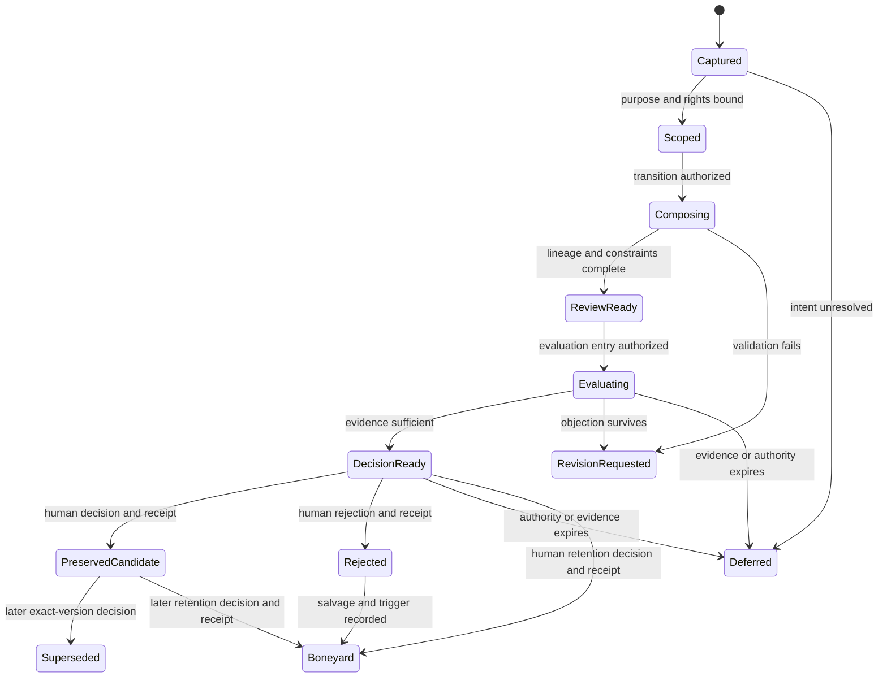

# HookCandidate Workbench v0.1

**Status:** Candidate low-fidelity product-design artifact  
**Fixture:** `hook_candidate.hx-001@0.1.0`  
**Content class:** synthetic, test-only, non-releaseable  
**Authority ceiling:** `propose`  
**Runtime effect:** none  
**Canon effect:** none  
**Publication effect:** none

## Purpose

Make the generic Chambered Workbench concrete by moving one `HookCandidate` through Aperture, Foundry, Constellation, and Gallery while the same object identity, lineage, evidence, authority, blockers, and transition history remain inspectable.

The fixture contains no release lyric. Its content pane uses a redacted synthetic payload so reviewing this public design artifact cannot be mistaken for publishing a creative asset.

## What this proves

The artifact succeeds only when an operator can answer, without opening another system:

1. What exact object and version am I viewing?
2. What chamber lens is active, and what lifecycle state is the object actually in?
3. Where did this candidate come from, and which versions derive from it?
4. What evidence supports or contradicts the proposed move?
5. Which moves are available, blocked, or awaiting authority—and why?
6. Who proposed, evaluated, would execute, may decide, and verifies the receipt?
7. What would change, what must remain unchanged, and can the change be reversed?
8. What happened previously, and which immutable receipt proves it?

## Persistent shell regions

| Region | Always visible | Must never imply |
| --- | --- | --- |
| Context bar | object id, semantic version, lifecycle state, chamber, responsible human, risk class, authority status, rights status, last material event | that chamber position equals lifecycle state or approval |
| Lineage rail | origin, parent and child versions, derivation type, current branch, superseded versions, downstream dependency count | that proximity or reuse creates ownership, preference, or authority |
| Work surface | exact content version or redacted payload, chamber-specific task, constraints, unresolved questions | that generated content is admitted, releaseable, or canonical |
| Move inspector | move purpose, capability, prerequisites, evidence requirement, expected effect, risk, reversibility, approver, availability, blocker reason | that a visible button grants permission |
| Evidence / authority / transition drawer | source bindings, claim map, counterevidence, freshness, grants, role declarations, prior/proposed state, receipt preview and completed receipts | that confidence, consensus, or prior approval expands scope |

The chamber rail is navigation. It changes which work is foregrounded; it does not mutate the object.

## Fixture identity

| Field | Fixture value |
| --- | --- |
| Object | `hook_candidate.hx-001@0.1.0` |
| Project | `music.fixture.operator-contract-extraction` |
| Payload | `[synthetic hook text intentionally omitted]` |
| Origin | `human_supplied_fixture` |
| Lifecycle state | `captured` |
| Current chamber | `chamber.aperture` |
| Canon status | `not_nominated` |
| Reuse status | `prohibited` |
| Publication status | `prohibited` |
| Rights status | `fixture_only` |
| Preference effect | `none` |
| Provider-resource effect | `none` |

`@0.1.0` identifies the immutable candidate-subject snapshot, not its governance state. Receipt-backed `captured → scoped → composing` transitions update separate ledger state refs/digests without rewriting `@0.1.0`. A content or other object-owned subject change creates a new object version such as `@0.2.0-a`.

## Chamber frame 1 — Aperture

**Operator job:** admit the source, separate source from interpretation, bind intent and rights context, and identify missing prerequisites.

| Persistent region | Visible state |
| --- | --- |
| Context bar | `captured`; authority `observe + propose`; rights `fixture_only`; next state not authorized |
| Lineage rail | one origin record; no derived versions; origin actor visible |
| Work surface | redacted payload, intended role `hook`, purpose `operator-contract fixture`, interpretation debt, rights declaration |
| Move inspector | `classify_structural_role` available; `attach_source_binding` available; `clarify_fixture_purpose` awaiting human; `propose_scope_complete` blocked |
| Drawer | origin evidence present; purpose evidence present; human intent confirmation missing; transition preview has no approval ref |

**Blocking condition:** `propose_scope_complete` remains unavailable until a named human confirms the fixture purpose and the rights status is explicitly bound to this exact object id/version/digest. Selecting Foundry is navigation only and cannot bypass the transition.

**Permitted documentary outcome:** propose `captured → scoped`. The frame does not apply that transition. Aperture cannot compose variants, publish, release, canonize, or mutate preference state.

## Chamber frame 2 — Foundry

**Operator job:** compose versioned alternatives from admitted inputs while preserving every derivation and constraint.

This frame assumes a separately proposed and receipted `scoped → composing` entry transition. Selecting Foundry does not create it.

| Persistent region | Visible state |
| --- | --- |
| Context bar | `composing`; exact parent `@0.1.0`; external execution blocked |
| Lineage rail | parent plus three proposed child variants `@0.2.0-a`, `@0.2.0-b`, `@0.2.0-c`; derivation operations named |
| Work surface | constraint set, redacted variant summaries, repetition warnings, mutation rationale, excluded inputs |
| Move inspector | `draft_variant` propose-only; `compare_structure` available; `record_constraint_failure` available; `propose_review_ready` conditional; protected action `external_test` is outside the candidate move catalog and blocked |
| Drawer | admitted input refs, mutation notes, tool/agent attribution, rights unchanged, evidence gaps and rollback class |

**Blocking condition:** a variant cannot become `review_ready` while its parent reference, mutation rationale, constraint check, or rights inheritance status is missing.

**Permitted documentary outcome:** propose `composing → review_ready`. The frame does not apply that transition. A generator may produce a candidate payload but cannot admit, choose, release, or promote it.

## Chamber frame 3 — Constellation

**Operator job:** compare variants, claims, criteria, relationships, counterevidence, authority, and decision readiness without collapsing evaluation into approval.

This frame assumes a separately proposed and receipted `review_ready → evaluating` entry transition with a named rubric and evaluator declarations. Selecting Constellation does not create it.

| Persistent region | Visible state |
| --- | --- |
| Context bar | `evaluating`; evaluator declarations present; decision `human_required` |
| Lineage rail | all variants retained; no winner edge; supersession has not occurred |
| Work surface | pairwise comparison, criterion-by-criterion evidence, disagreement, repetition history, rights and release risks |
| Move inspector | `record_finding`, `request_more_evidence`, and `record_dissent` available; `propose_decision_ready`, `propose_revision_requested`, and `propose_evaluation_deferred` are propose-only; approval is outside the candidate move catalog and unavailable to the evaluator |
| Drawer | rubric version, evaluator identity and conflicts, evidence bundle digest, counterevidence, exact authority request, transition preview |

**Blocking condition:** a score without a rubric, evidence, evaluator declaration, and decision-use explanation cannot support selection. A unanimous evaluation still cannot supply human decision authority.

**Permitted documentary outcome:** propose one of `evaluating → decision_ready`, `evaluating → revision_requested`, or `evaluating → deferred`. Evaluation cannot apply any of them and cannot reject the object as a binding decision.

## Chamber frame 4 — Gallery

**Operator job:** preserve the exact decision, receipt, lineage, debt, and possible future moves without turning preservation into release, reuse, canon, or preference.

| Persistent region | Visible state |
| --- | --- |
| Context bar | `preserved_candidate`; decision receipt bound; canon `no`; publication `prohibited`; reuse `requires_new_decision` |
| Lineage rail | selected, rejected, deferred, and superseded branches remain inspectable with reasons |
| Work surface | redacted candidate summary, decision rationale, acknowledged weaknesses, rights state, boneyard salvage and revisit trigger |
| Move inspector | `inspect_decision_receipt` available; `fork_candidate`, `propose_reuse_review`, and `propose_boneyard_retention` are propose-only; `record_observed_outcome` requires observed use; `publish` and `promote_to_canon` are outside the candidate move catalog and blocked |
| Drawer | immutable receipt, exact object digest, approval scope, expiry, evidence snapshot, unresolved objections, outcome status `not_observed` |

**Blocking condition:** entering Gallery changes only presentation context. Preservation requires a receipt-backed transition; publication, release, reuse, canon admission, and Preference Graph mutation each require a separate grant and decision.

**Illustrated governed outcome:** after a separate exact-version human decision and immutable receipt, a future system could record `decision_ready → preserved_candidate`, `rejected`, `deferred`, or `boneyard`. This frame only specifies how that result would be inspected. No terminal label implies deletion; retention policy controls what remains.

## Honest state path

This diagram shows branches and stop conditions. It does not claim a feedback loop, learning, scale, or compounding.

## Accessibility and legibility requirements

- Never encode lifecycle state, authority, freshness, or blockers by color alone.
- Every status has a text label and short explanation.
- Chamber navigation, lineage nodes, move controls, and drawer tabs are keyboard reachable in a logical order.
- The context bar is announced before chamber content by assistive technology.
- Blocked moves remain discoverable with a concise reason and remediation, except where revealing the reason would create a security risk.
- Evidence and grant timestamps use explicit dates and time zones.
- Exact object versions and digests are copyable.
- Reduced-motion mode removes animated transitions without removing state-change meaning.
- Comparison tables preserve row and column headers on narrow surfaces; mobile may stack criteria but may not hide dissent or blockers.
- Synthetic fixture content is labeled as such in visible text, not only metadata.

## Operator review checklist

- [ ] The operator can distinguish chamber from lifecycle state.
- [ ] The exact object version is visible in every frame.
- [ ] Every derived variant identifies its parent and mutation.
- [ ] Rights and publication status remain visible throughout.
- [ ] Available and blocked moves both explain their authority requirements.
- [ ] Proposer, evaluator, executor, decision authority, and receipt verifier remain distinguishable.
- [ ] Evaluation results cannot masquerade as approval.
- [ ] Gallery cannot imply release, reuse, canon, or preference mutation.
- [ ] Failure, deferral, rejection, supersession, and boneyard paths remain navigable.
- [ ] The state diagram exposes branches and does not self-certify a loop.
- [ ] No displayed number or status pretends to be live telemetry.

## Deliberate exclusions

This artifact does not include actual song content, runtime components, executable schemas, database projections, model calls, scoring automation, external tests, provider resources, publication actions, Preference Graph updates, deployment, or canon promotion.
