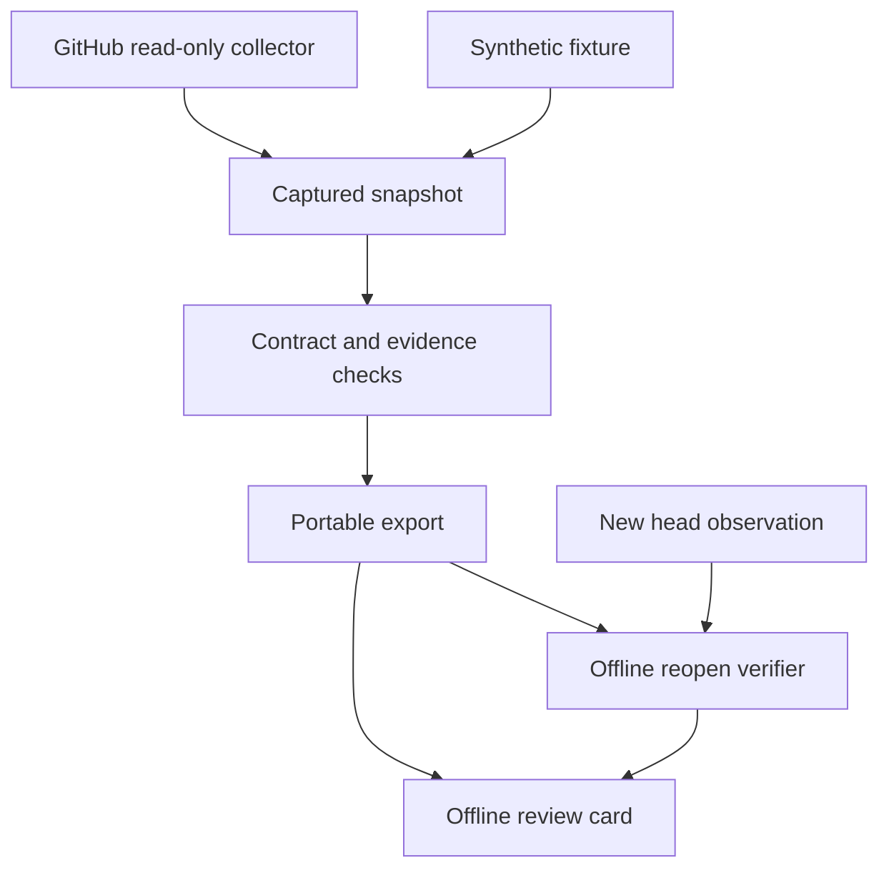

# Read-only review card and complete portable export

Written specification v0.2 · October 3, 2026, America/Chicago; approval recorded October 4, 2026, UTC

**Status:** written specification approved by Bryan's message “Spec Approvals.” Approval permits the implementation-plan stage. The conversational architecture was approved by the request to build the expanded recommendation; documentation publication was separately authorized by “Publishing Authorized by Bryan.” Product implementation, runtime activation, and release have not occurred.

**Owner:** Bryan Sayler; proposed capability home: Quirk OS. **Lead skill:** Build Quirk Systems; process: Superpowers architectural path. **Inspected base:** `8af1f4f5bc4754e1af982d52729aa235e9578ccd`.

## 1. Outcome and scope

An operator selects one Quirk OS PR, captures its exact source and review evidence through read-only GitHub access, and receives an offline review card plus a portable evidence directory. After copying that directory elsewhere, the card remains readable and a verifier can check all required captured payloads without fetching anything. Missing evidence and stale source remain visible.

The distinctive behavior is that evidence closure, source freshness, check success, automated review, human review, and action permission remain separately inspectable. A polished card must never hide an unknown or turn an observation into permission.

For this first release, the live collector supports only `Quirk-Systems/quirk-os` PRs. Offline synthetic fixtures use the same repository identity. Broader repositories, standalone tasks, and domain adapters require a later compatibility decision. A caller-provided intended outcome and required check names are declared inputs, never requirements invented from an agent's confidence.

Source operations are read only. The tool creates explicit new local snapshots, exports, and render outputs. It has no GitHub write endpoint, merge path, deployment path, Supabase client, scheduler, model call, or approval actuator. It does not repair #105, integrate unmerged #76, publish a card, or authorize another tool to act.

Success requires one actual PR capture and an independently repeated transfer/reopen exercise, alongside deterministic adversarial tests. A fixture-only demonstration earns local mechanical evidence, not usefulness or portability across all platforms.

## 2. Current sources and overlap

All main-branch implementation sources below were inspected at the base commit above. Repository-wide tracked file inventory returned no `AGENTS.md` or `.coderabbit.yaml`. Refresh source and instructions before implementation.

| Existing source | Use in this design | Limitation |
| --- | --- | --- |
| [Source binding v2](../../../schemas/source-binding.schema.json) | Stable identity, provider locator, freshness, candidate/pull state | PR source is mutable work; it is not automatically canonical |
| [Projection envelope v1](../../../schemas/projection-envelope.schema.json) | Closed outer envelope; review fields under `projection` | New display states must not widen its root or imply admission |
| [Sync receipt v2](../../../schemas/sync-run-receipt.schema.json) | Local capture/export receipt, exact hashes, scoped observations | A receipt is not authenticated approval or a runtime grant |
| [Canonical/runtime mapping](../../../mappings/sync-control-plane.v1.yaml) and [mapper](../../../scripts/sync_control_plane/mappers.py) | Preserve existing stable keys; future runtime translation seam | No database projection or mapper change in this release |
| [Receipt hashing](../../../scripts/applause_gate/receipt.py) | Existing sorted-key, compact UTF-8 JSON hashing convention | Not a claim of general RFC canonical JSON compliance |
| [Furniture receipt verifier](../../../scripts/furniture_brief/receipt.py) | Lesson: a hash-chain prefix needs an external anchor to expose tail removal | Do not import domain-specific furniture semantics into review records |
| [Distill file writer](../../../scripts/distill_loop/common.py) | Lesson: exclusive creation and explicit partial-write handling | Its per-file replacement is not a complete directory transaction |
| [Evidence Binding caller](../../../.github/workflows/evidence-binding.yml) | Existing candidate evidence requirements | A new review workflow must not bypass this caller |

Open PR scopes inspected through GitHub file inventories:

| PR and observed head | Consequence |
| --- | --- |
| [#105](https://github.com/Quirk-Systems/quirk-os/pull/105), `39f9e41962bc4a0800e3bb62c84016e04088bb81` | Distill export-completeness repair owns its existing CLI/helpers/tests. Do not edit those files or reopen repaired work. |
| [#76](https://github.com/Quirk-Systems/quirk-os/pull/76), `f85e1729b4d973b1333c8a13327d24e016964fd3` | Its unsigned-rationale README was read at this head. Borrow integrity/freshness distinctions; do not import its unmerged format as an admitted dependency. |
| [#112](https://github.com/Quirk-Systems/quirk-os/pull/112), `c770fdd76f7c82589b244a4cfd8d322730f51533` | New workflow docs/checklists own their proposed terminology. Avoid editing them in this slice. |

The GitHub list returned 55 open PRs. Titles alone do not establish compatibility. Before implementation, refresh new-file collisions and relevant source changes; stop for a material interface conflict.

## 3. Selected architecture

Use one Python module with a deterministic offline core, a bounded GitHub reader, and a static renderer. Prefer the repository's standard-library and unittest patterns; use the already declared `jsonschema` dependency for schema conformance tests. The generated card has inline CSS, no JavaScript, and no remote assets.

| Unit | Job | Inputs and outputs |
| --- | --- | --- |
| `capture.py` | Collect exact-source observations without writes to GitHub | Selected PR, explicit outcome/check requirements → snapshot and captured response bytes |
| `contracts.py` | Validate protocol, evidence links, identities, bounds, and display state | Snapshot or bundle → structured findings; no network or file mutation |
| `bundle.py` | Publish a new complete export or leave a diagnosable incomplete attempt | Valid snapshot payload set → new directory and external manifest digest |
| `render.py` | Render the same semantic card from verified records | Verified projection → HTML and Markdown |
| `__main__.py` | Bounded commands and structured results | Explicit paths and options → JSON summary and exit status |

Place these in new `scripts/review_card/` files. Add new schemas, fixtures, tests, and `docs/review-card/README.md`; do not refactor unrelated modules. The implementation plan will enumerate individual files and test order after this specification is approved.

Alternative A, a Next.js/Vercel UI now, adds actor authorization and preview-data boundaries before export mechanics are established. Alternative B, a new integration service, duplicates the existing sync responsibility and adds operations. Both remain deferred. The chosen module can later feed an admitted runtime and delivery adapter.

## 4. Operator journey and proposed commands

The following is the specified command interface, not a claim that these commands are implemented yet. Run the future module with `PYTHONPATH=scripts python -m review_card`.

| Command | Specified behavior |
| --- | --- |
| `capture --pr NUMBER --out NEW_DIRECTORY --outcome TEXT [--require-check NAME ...]` | Read the allowlisted PR and exact-head evidence; create a new portable export. Required check names are exact strings. No supplied list means check requirements are unknown. |
| `build --snapshot INPUT_DIRECTORY --out NEW_DIRECTORY` | Validate a captured/synthetic snapshot and its payload closure, then export without network access. |
| `verify BUNDLE --expected-manifest-sha256 DIGEST` | Validate against the separately retained manifest digest; no network, execution of payloads, or extraction. |
| `reopen BUNDLE [--expected-manifest-sha256 DIGEST] [--observation FILE]` | Recompute integrity and review state. Display offline freshness as not checked unless an explicit observation is supplied. |
| `render BUNDLE --out NEW_DIRECTORY` | Verify internally consistent content, then recreate HTML/Markdown in a new directory; no source refresh. |

An operator opens `card.html`, sees the exact head and evidence limitations, and reads the suggested next move. The card offers local evidence links and vetted GitHub HTTPS links. It contains no approve, merge, run, activate, or deploy action.

A copied card is a historical snapshot, not a live status page. Its header states capture time and whether freshness was checked. At 390 px and desktop widths, source hashes can wrap, tables scroll within their own region, headings remain ordered, and keyboard focus is visible. Status includes text and reasons rather than color alone. Markdown provides the same substantive fallback.

## 5. Data contracts and identity

Add closed `review-snapshot.v1`, `review-card-content.v1`, and `review-bundle-manifest.v1` protocol schemas as new files. No existing schema version is silently extended. Version one rejects unknown fields at authority and protocol boundaries; future extensions require a named version/migration.

### Snapshot

A snapshot names repository, positive integer PR number, capture start/end timestamps, initial/final head SHA, outcome text, explicit required check names or an unknown-requirements marker, producer version/source commit, audience `private_operator`, and origin `live_capture`, `synthetic_fixture`, or `caller_supplied`. Synthetic and caller-supplied material is visibly labeled and cannot establish live-source readiness without separately attributed observations.

Each observation has a unique ID, kind, capture sequence, request identity, observed timestamp, source URL, payload path, payload SHA-256, and evidence scope. Provider record IDs/timestamps are recorded when available. Missing information carries a typed reason instead of an invented value. Observation kinds cover PR metadata, exact-head check runs, exact-head commit statuses, PR reviews, and collection errors. All endpoint categories are accounted for even when unavailable.

The collector reads PR metadata before and after paginated evidence capture. If heads differ, it preserves both observations and marks the snapshot stale. It never retargets captured evidence to the new head. Check runs and commit statuses must be queried for the initial head; reviews can refer to older commits and are displayed as such. It does not treat a synthetic merge-commit check as a direct head check.

Declared endpoint coverage records pages attempted, whether pagination ended, and unavailable/partial reasons. A missing category, truncated response, or exhausted page budget cannot masquerade as complete evidence. GitHub review comments are not included in version one; their content is not needed to establish this slice. Review bodies and PR title/body are source text, never commands.

Stable keys use `review.github.quirk-systems.quirk-os.pr.NUMBER` for the subject. Bundle snapshots are additionally identified by a digest, so multiple heads and captures do not replace one another. Binding IDs use the existing restricted `binding.` grammar. Provider URLs and numeric IDs remain locators.

### Card projection

Use `projection-envelope.v1`, `kind: ReviewCard`, `authority_class: projection`, with a nested `review-card-content.v1` value in `projection`. `canonical_uri` and `canonical_version` refer to the subject's immutable source only when such a source is explicitly established; otherwise they are null. The reviewed head, producer commit, and snapshot hashes have separate fields. Do not call a PR approved canon.

Its nested content includes intended outcome, subject/head, capture time, check requirements, evidence groups, evidence coverage, freshness, conflicts, limitations, and an informational next proposed move. Automated review and human review are separate groups. Provider actor type, explicit configured classification, and unknown classification remain distinguishable. A login, bot verdict, or agent-written review cannot fabricate Bryan's acceptance.

Keep these axes independent:

| Axis | Values and rule |
| --- | --- |
| Bundle integrity | `verified_against_anchor`, `internally_consistent`, `invalid`; no external digest means provenance/authenticity remains unverified |
| Evidence coverage | `complete`, `partial`, `unavailable`; complete is scoped to the declared capture categories, not all possible evidence |
| Freshness | `not_checked`, `unchanged`, `stale`, `unavailable`; offline copying never refreshes it |
| Review display | `ready_for_review`, `blocked`, `stale`; informational only |
| Authorization | Fixed `none`; no granted action, human acceptance, or runtime activation |

`stale` wins when a comparable head differs. Otherwise, `blocked` applies to invalid integrity, incomplete required coverage, unknown check requirements, a required check missing/not successful/ambiguous, or a source conflict. `ready_for_review` requires complete declared coverage, explicit check requirements satisfied on the captured head, no conflict, and unchanged head during live capture. Offline reopening retains historical capture disposition but labels present freshness `not_checked`; it never asserts present readiness. A genuinely empty explicit requirement list is allowed and shown as an operator declaration.

Local test evidence, hosted checks, bot review, and human review remain distinct. Historical review state is reported, but this release evaluates no actor's merge authority. GitHub branch policies are not inferred from successful checks.

### Local receipt

Emit a `sync-run-receipt.v2` local receipt for the export operation, with `run_type: project`, exact input/output/evidence references, timestamps, and SHA-256 hashes. Only completed valid exports have `status: succeeded`; failed or incomplete attempts have an error and a terminal non-success status. Do not populate `authority_ref` with an inferred grant. Omit unused optional supersession fields rather than adding a null field that triggers extra schema requirements.

The receipt's own hash omits only `receipt_hash`, following its schema. Its output hashes cover the already finalized snapshot, projection, captured payloads, schemas, and rendered cards; they exclude the receipt itself and the later manifest, avoiding a circular dependency. Export failure is not a failed GitHub check. A succeeded export can contain a blocked review; its outcome records that distinction. Receipt immutability is a protocol obligation with tamper detection, not proof of write-protected filesystem storage.

## 6. Portable export contract

The export includes `snapshot.json`, original captured response payloads, `projection.json`, `receipt.json`, `card.html`, `card.md`, the specific protocol/Quirk schemas used, `README.md`, and `manifest.json`. The new directory is the whole supported handoff unit. Arbitrary repository contents, external attachments, CI artifact payloads, credentials, logs, and source links outside this declared set are not transitively fetched.

The manifest contains protocol version, subject and source identities, producer version/commit, payload count, and a sorted inventory of every other file with normalized relative path, byte size, SHA-256, and role. Dependency references within protocol records distinguish required embedded payloads from optional external citations. Required payloads must all resolve to this inventory; optional external citations are visibly external and are not claimed to be available offline.

Hash payloads as exact bytes. Hash manifest bytes separately; never include its own digest inside the hashed manifest. Print the manifest digest in the structured command result and allow the operator to retain it separately for transfer verification. An attacker replacing all files and their internal hashes cannot be detected without a trusted separately retained digest. Internal consistency is not source authenticity, truth, approval, or permission.

All included schemas must have their local reference closure present. Validate instances using the versioned schemas and semantic rules, including non-null terminal receipt timestamps/hashes. Reject remote schema resolution. Display markup is generated from the same normalized projection used for Markdown; no side file may disagree about head, readiness, limits, or authority.

### Write and recovery rules

Create the output directory exclusively; refuse any existing destination. Never overwrite or delete an earlier export. Refuse destination or payload path components that are symlinks; normalize and validate relative paths before writing. Reject absolute paths, traversal, backslashes, drive prefixes, duplicate paths, case-fold collisions, reserved protocol paths, and files outside the chosen destination. Source inputs and output may not overlap.

Write the explicit payload set into the newly reserved directory with exclusive file creation. Validate the complete directory before creating `manifest.json` as the final marker. Use a temporary sibling for that marker and exclusive no-overwrite publication; no replacing another producer's marker. An exception leaves a partial directory with no success marker and exits nonzero. Preserve it for diagnosis; retry into a new destination. No filesystem-wide transaction or power-loss atomicity is promised.

The verifier enumerates all regular files and compares that enumeration against the manifest, rejecting missing files, unexpected files, symlinks, altered bytes, missing schema dependencies, duplicate IDs, unresolved required refs, and disagreement among snapshot/projection/receipt/card semantics. It regenerates card bytes from the validated projection with the versioned renderer and compares them, rather than trying to infer semantic equivalence from HTML. An unsupported renderer version fails explicitly. It treats a missing manifest as incomplete. It reads data only; no embedded code, script, instruction, or link is executed.

A complete export means complete closure of this declared captured review snapshot. It does not mean a copy of the entire PR repository, all GitHub history, every check artifact, or uncollected private context. Zip packaging is deferred; copying the directory must preserve bytes and names.

## 7. Collector, security, and limits

The live adapter permits HTTPS GET only to fixed GitHub API routes derived from the allowlisted repository and validated PR/head values. It does not follow arbitrary URLs in source content, resolve user-supplied hosts, use shell command text from records, or send credentials to redirect destinations. It preserves source URLs as data after rejecting embedded credentials, executable schemes, and recognized token-bearing query strings.

Credentials, if needed, come from the operator's `GITHUB_TOKEN` environment variable. This is the only credential source in version one; never search local credential files. They never enter snapshots, headers retained in payloads, command summaries, generated pages, or errors. Token scope must be read only. No account authorization or secret-provisioning step is performed by the card itself.

Protocol input parsing rejects duplicate JSON keys, non-finite numbers, unsupported versions, invalid/unencodable Unicode, excessive nesting, invalid timestamps, and malformed SHA values. Dynamic HTML text and attributes are escaped; Markdown also escapes raw HTML and markup delimiters. Links permit only vetted HTTPS GitHub locations or validated local payload paths. Apply a restrictive inline-content policy and no external scripts, styles, fonts, or images.

Initial limits: 32 MiB total input payload bytes, 2 MiB per HTTP response, 256 payload files, 128 evidence records per group, JSON nesting 32, 16,384 characters per displayed text field, 100 pages across the capture, 200 HTTP requests, 10-second request timeout, and 120-second capture deadline. Oversized source text is retained only if within payload limits; the card shows an explicit excerpt indicator rather than pretending an excerpt is the whole source. Resource-limit exhaustion blocks complete capture. Counts, sizes, and timeouts are configuration constants with tested boundary cases.

No automatic retries in version one. A rate limit, authorization failure, or timeout produces an explicit unavailable/partial observation and a blocked card if core identity can still be established. If subject/head identity cannot be established, no successful export is emitted. Diagnostics never reinterpret inaccessible evidence as an empty passing set.

These are bounded protocol controls, not a general secret detector or a claim that arbitrary local directories are safe. The operator chooses a permitted local destination and audience. The first release is private operator use; public publishing and customer/tenant access are outside scope.

## 8. Determinism and failure semantics

Normalize semantic records by stable provider ID, kind, head, and source timestamp; preserve original source bytes in payloads. Identical observation IDs with identical payload hashes deduplicate. Identical IDs with different payloads remain an explicit conflict. Missing provider timestamps do not let arrival order establish truth; retain observations and mark ambiguous consequential ordering blocked.

Given the same snapshot bytes, requirements, protocol version, and explicit time inputs, projection and card bytes are deterministic. Capture timestamps are real observations, not fixed fixtures in live use. Different captures can yield different bundles even for one head. No workflow effect is retried or duplicated because this tool has no action actuator.

Structured summaries report command status, subject/head, review display state, coverage, freshness, integrity basis, output path, manifest digest when available, and typed errors. Exit codes: `0` successful command mechanics; `2` invalid input/contract/incomplete export; `3` capture identity/access failure; `4` unsafe or occupied output destination. A blocked but structurally complete review export can return `0` only with its blocked disposition explicit. Review-ready is never implied by exit status.

## 9. Acceptance and evidence

Use unittest fixtures and the existing pinned schema validation dependency. New feature CI runs on changes to the new module, schemas, fixtures, tests, docs, and its own workflow. Pin every remote action/reusable workflow to a full commit SHA with version comments. Retain candidate-commit test results and fixture evidence; local pass and hosted pass are separate.

| Test | Required result |
| --- | --- |
| Complete PR snapshot and new destination | Card and export agree on exact head; all payloads and schema refs verify |
| Source unavailable after transfer | Existing card opens offline; verifier makes no network request; freshness is not checked |
| Reuse export as input in a fresh process | Reconstructed semantic card matches the saved projection without original source paths |
| Required payload or schema missing | Verification rejects closure; no success marker can be generated |
| Payload changed, manifest unchanged | Digest mismatch rejects |
| Payload and manifest both replaced | Internal-only mode identifies no authenticity proof; retained external digest rejects replacement |
| A final evidence entry is removed | Inventory/count or external manifest digest exposes missing declared payload; no unanchored completeness claim |
| Head changes during capture or explicit later observation | Card is stale; old evidence stays on old head |
| No requirements supplied; missing/failed/pending required check | Blocked; checks and requirement uncertainty are visible |
| Different check contexts share one name | Ambiguous match blocks instead of choosing a passing instance |
| Old review or synthetic merge check is supplied | Remains scoped to its original commit and evidence type |
| Pagination stops early; access denied; rate limit; timeout | Explicit incomplete/unavailable coverage; no fabricated empty success |
| Duplicate and reordered observations | Stable result; conflicting duplicates cannot disappear |
| Process interrupted during payload or marker write | Non-success/incomplete directory; earlier exports untouched; retry uses new destination |
| Traversal, symlink, collision, hostile destination, source/output overlap | Refuse writes outside the declared safe new destination |
| Script/HTML/instruction text in source | Escaped visible data; zero tool dispatch or script execution |
| Authority-bearing unknown fields or forged approval | Protocol rejects unknown authority; no resulting action grant |
| Budget/encoding/JSON boundary violations | Typed failure, bounded work, no recursion crash mislabeled success |
| 390 px, keyboard-only, Markdown fallback | Essential head, status reasons, evidence limits, and next move remain accessible |

A real-use trial asks Bryan to inspect one PR card, identify which evidence belongs to its exact head, explain the difference between bot review and his approval, copy the export, reopen it, and decide whether it saves effort. Capture actual assistance, interruption, correction, cleanup, and usefulness judgment. Do not prefill his preference or call agent simulation human evidence.

Initial mechanical portability target: Linux/Python 3.12+ and a modern browser viewing local HTML. macOS, Windows, iOS file handling, hosted delivery, and cold operation without an installed verifier remain unverified until exercised. Transfer proof must state both hosts and exact tool version. Supported absence behavior: read the saved card, preserve blocked/unknown state, and wait for the appropriate human decision; no unattended actuator runs.

## 10. Decisions, handoff, and release boundary

**Admission decision: Constrain.** This is a reviewed-for-consistency candidate specification, not an implemented capability, Golden release, installed agent, admitted manifest, or demonstrated user win.

Recorded design decisions: extend Quirk OS rather than a new service; use deterministic offline records rather than model interpretation; maintain separate evidence/freshness/authority axes; require declared payload closure and external digest support; create new exports rather than overwrite; use a static local interface before hosted runtime access. These decisions can be revised when evidence identifies a concrete gap.

Authorized now: record written-spec approval and write/commit/publish the implementation plan on the existing documentation branch. Next required gate: Bryan reviews that plan and selects its execution method. Implementation follows that gate; runtime admission, merging, hosted delivery, and deployment remain separate decisions. Do not treat this design-stage approval as permission to skip later explicit process stages.

CodeRabbit 0.8.2 was installed in the preceding turn. Authentication returned `not_authenticated`, and agent login returned `environment_unsupported`; no CodeRabbit review has run. An actual implementation diff requires authenticated review with explicit source scope. Manual review cannot be labeled CodeRabbit. Resolve credentials through a user-controlled terminal or supported credential provisioning, not plaintext secrets in chat.

Resume by checking this spec's commit, current main, overlapping PR heads, instruction changes, and source/schema versions. Stop for source mismatch, material interface conflict, required payload uncertainty, unapproved external effect, or expanded audience/authority. No Supabase migration or Vercel deployment is needed for the first local release.

Rollback of this documentation is a scoped revert or superseding spec. Later product rollback disables the module's use without editing prior exports or evidence. No reusable runtime capability is deposited yet; the current deposit is this explicit candidate contract and its adversarial proof requirements.
