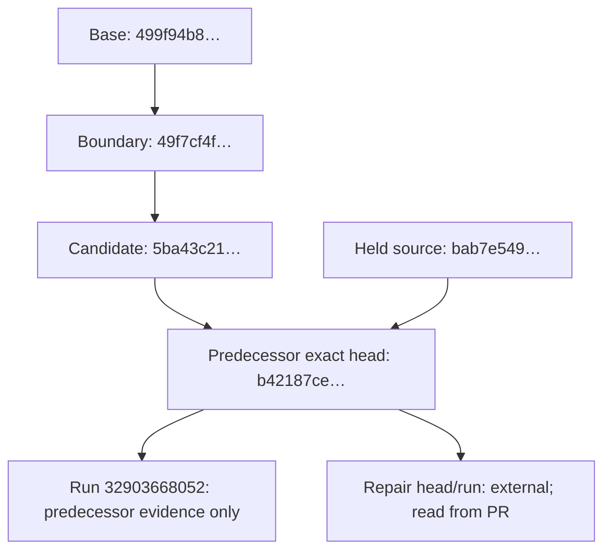

# Exact-head evidence is traceable; authority does not travel with it

This disposition records how predecessor evidence can be located without treating it as authority for a later head. It makes no claim about merge, broader Canon, runtime, deployment, Supabase, providers, publication, transactions, or Preference Graph effects.

The single top-down rail remains readable on mobile. Direct labels state each relationship; the phrases “predecessor evidence only” and “external; read from PR” are the color-independent fallback.

## Text alternative

| Item | Exact identifier | Disposition |
| --- | --- | --- |
| Base | `499f94b8d12e29dd7804cc9b537fd70f6a8048d8` | Traceable starting point only. |
| Boundary commit | `49f7cf4fe3cffd7a9daae87cd045ff72d245fec1` | Traceable boundary history only. |
| Candidate commit | `5ba43c210b0c64401640af17d14fe681a93bb425` | Traceable candidate history only. |
| Predecessor exact head | `b42187cedaa8756be3004b5995bb975757505da9` | The head to which the predecessor evidence applies. |
| Held source | `bab7e54977a6db872d1fac718db8c2b935e8fe95` | Traceable held-source reference only. |
| Predecessor external run | `32903668052` | Predecessor evidence only; it does not authorize a repair commit. |
| Repair commit head and run | External | Read the new head and its check run from the pull request; neither is asserted here. |
