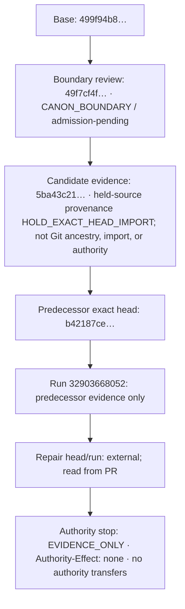

# Exact-head evidence is traceable; authority does not travel with it

This disposition records how predecessor evidence can be located without treating it as authority for a later head. It makes no claim about merge, broader Canon, runtime, deployment, Supabase, providers, publication, transactions, or Preference Graph effects.

The single top-down rail remains readable on mobile. Direct labels state each relationship; “predecessor evidence only,” “external; read from PR,” and “no authority transfers” are the color-independent fallback.

## Text alternative

| Relationship | Exact identifier or review label | Meaning and non-transfer rule |
| --- | --- | --- |
| Base → boundary review | `499f94b8d12e29dd7804cc9b537fd70f6a8048d8` → `49f7cf4fe3cffd7a9daae87cd045ff72d245fec1`; `CANON_BOUNDARY` / admission-pending | A traceable review sequence only; it grants no admission or authority. |
| Boundary review → candidate evidence | `49f7cf4fe3cffd7a9daae87cd045ff72d245fec1` → `5ba43c210b0c64401640af17d14fe681a93bb425` | Candidate evidence follows the boundary review; it is not a promotion or effect claim. |
| Candidate evidence → predecessor exact head | `5ba43c210b0c64401640af17d14fe681a93bb425` → `b42187cedaa8756be3004b5995bb975757505da9`; held source `bab7e54977a6db872d1fac718db8c2b935e8fe95`; `HOLD_EXACT_HEAD_IMPORT` | Held source is provenance inside the candidate-evidence annotation only, not Git ancestry, import, or authority. |
| Predecessor exact head → predecessor external run | `b42187cedaa8756be3004b5995bb975757505da9` → `32903668052` | The run is predecessor evidence only; it does not authorize a repair commit. |
| Predecessor external run → repair evidence | `32903668052` → external repair head and run | Read the repair head and run from the pull request; this relationship is a review sequence, not transferred evidence or authority. |
| Repair evidence → authority stop | external repair head and run → `EVIDENCE_ONLY` / `Authority-Effect: none` | No authority travels with exact-head evidence; no merge, broader Canon, runtime, deployment, Supabase, provider, publication, transaction, or Preference Graph effect is claimed. |
